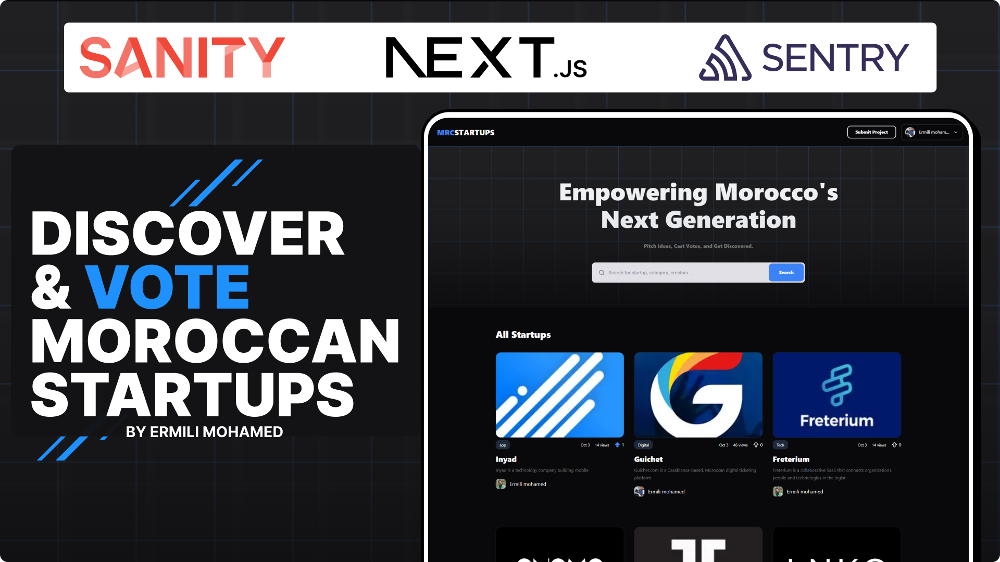

[Live Demo](https://mr-startups.vercel.app/)

# MRC Startups - Moroccan Startup Platform

A modern, full-stack platform designed to showcase and discover Moroccan startups. Built with Next.js 15, Sanity CMS, and NextAuth, this platform enables entrepreneurs to pitch their ideas, get discovered, and connect with the Moroccan startup ecosystem.

## 🚀 Features

### Core Functionality

- **Startup Discovery**: Browse and search through Moroccan startups with advanced filtering
- **Startup Submission**: Entrepreneurs can submit their startups with detailed pitches using Markdown
- **User Authentication**: Secure GitHub OAuth integration for seamless user experience
- **Favorites System**: Users can favorite startups they're interested in
- **Real-time Updates**: Live data synchronization using Sanity Live
- **Responsive Design**: Mobile-first approach with modern UI/UX

### Technical Features

- **Server-Side Rendering (SSR)**: Optimized performance with Next.js App Router
- **Type Safety**: Full TypeScript implementation with Zod validation
- **Content Management**: Sanity Studio for easy content management
- **Error Monitoring**: Sentry integration for production error tracking
- **SEO Optimized**: Server-side rendering for better search engine visibility

## 🛠️ Tech Stack

### Frontend

- **Next.js 15** - React framework with App Router
- **React 19** - Latest React with concurrent features
- **TypeScript** - Type-safe development
- **Tailwind CSS 4** - Modern utility-first CSS framework
- **Framer Motion** - Smooth animations and transitions
- **Radix UI** - Accessible component primitives
- **Lucide React** - Beautiful icon library

### Backend & CMS

- **Sanity CMS** - Headless content management system
- **GROQ** - Powerful query language for content
- **NextAuth.js** - Authentication library with GitHub provider
- **Server Actions** - Modern server-side data mutations

### Development & Deployment

- **pnpm** - Fast, disk space efficient package manager
- **ESLint** - Code linting and formatting
- **Turbopack** - Fast development builds
- **Vercel** - Optimized deployment platform

### Additional Libraries

- **Zod** - Schema validation
- **Sonner** - Toast notifications
- **next-themes** - Theme management
- **slugify** - URL-friendly slugs
- **Markdown Editor** - Rich text editing capabilities

## 🏗️ Architecture

### Project Structure

```
mr-startups/
├── app/                    # Next.js App Router
│   ├── api/               # API routes
│   ├── startup/           # Startup pages
│   ├── user/              # User profiles
│   └── studio/            # Sanity Studio
├── components/            # Reusable UI components
│   └── ui/               # Base UI components
├── lib/                  # Utilities and configurations
│   ├── actions/          # Server actions
│   └── queries/          # Data fetching logic
├── sanity/               # Sanity CMS configuration
│   ├── schemaTypes/      # Content schemas
│   └── lib/             # Sanity utilities
└── hooks/               # Custom React hooks
```

### Key Components

- **StartupCard**: Displays startup information with favorite functionality
- **StartupForm**: Markdown-enabled startup submission form
- **SearchForm**: Advanced search and filtering
- **Navbar**: Navigation with user authentication
- **ProductsSection**: Grid layout for startup listings

### Data Flow

1. **Content Creation**: Users submit startups through the form
2. **CMS Management**: Sanity Studio for content management
3. **Data Fetching**: Server-side data fetching with GROQ queries
4. **Real-time Updates**: Sanity Live for instant content updates
5. **User Interactions**: Optimistic updates for favorites and interactions

## 🚀 Getting Started

### Prerequisites

- Node.js 18+
- pnpm (recommended) or npm
- GitHub OAuth app (for authentication)
- Sanity account and project

### Installation

1. **Clone the repository**

   ```bash
   git clone <repository-url>
   cd mr-startups
   ```

2. **Install dependencies**

   ```bash
   pnpm install
   ```

3. **Environment Setup**
   Create a `.env.local` file with the following variables:

   ```env
   # NextAuth Configuration
   AUTH_SECRET=your-auth-secret
   AUTH_GITHUB_ID=your-github-client-id
   AUTH_GITHUB_SECRET=your-github-client-secret

   # Sanity Configuration
   NEXT_PUBLIC_SANITY_PROJECT_ID=your-sanity-project-id
   NEXT_PUBLIC_SANITY_DATASET=production
   SANITY_API_READ_TOKEN=your-sanity-read-token
   SANITY_API_WRITE_TOKEN=your-sanity-write-token

   # Optional: Sentry (for error monitoring)
   SENTRY_DSN=your-sentry-dsn
   ```

4. **Sanity Setup**

   ```bash
   # Generate Sanity types
   pnpm typegen
   ```

5. **Run the development server**

   ```bash
   pnpm dev
   ```

6. **Access Sanity Studio**
   Visit `http://localhost:3000/studio` to manage content

### Available Scripts

- `pnpm dev` - Start development server with Turbopack
- `pnpm build` - Build for production
- `pnpm start` - Start production server
- `pnpm lint` - Run ESLint
- `pnpm typegen` - Generate Sanity TypeScript types

## 🔧 Configuration

### Sanity Studio

- Access at `/studio` route
- Configured with Vision plugin for GROQ queries
- Markdown support for rich content editing
- Custom structure for organized content management

### Authentication

- GitHub OAuth provider
- Automatic user creation in Sanity
- Session management with NextAuth

### Content Schema

- **Startup**: Title, description, category, image, pitch (Markdown)
- **Author**: User information from GitHub
- **Favorites**: User-startup relationships

## 🌐 Deployment

### Vercel (Recommended)

1. Connect your GitHub repository to Vercel
2. Add environment variables in Vercel dashboard
3. Deploy automatically on push to main branch

### Environment Variables for Production

Ensure all required environment variables are set in your deployment platform.

## 📱 Features in Detail

### Startup Management

- **Submission**: Rich Markdown editor for detailed pitches
- **Categorization**: Organized by industry categories
- **Media**: Image support for startup logos/visuals
- **Analytics**: View tracking and favorite counts

### User Experience

- **Search**: Real-time search across all startups
- **Favorites**: Save startups for later review
- **Responsive**: Optimized for all device sizes
- **Performance**: Server-side rendering for fast loading

### Content Management

- **Sanity Studio**: Intuitive content management interface
- **Live Preview**: Real-time content updates
- **Version Control**: Content history and rollback
- **Media Management**: Optimized image handling

## 🤝 Contributing

1. Fork the repository
2. Create a feature branch (`git checkout -b feature/amazing-feature`)
3. Commit your changes (`git commit -m 'Add amazing feature'`)
4. Push to the branch (`git push origin feature/amazing-feature`)
5. Open a Pull Request

## 📄 License

This project is licensed under the MIT License - see the LICENSE file for details.

## 🙏 Acknowledgments

- Built with Next.js and Sanity
- UI components from Radix UI
- Icons from Lucide React
- Deployed on Vercel

---

**MR Startups** - Connecting Moroccan entrepreneurs with opportunities 🚀
